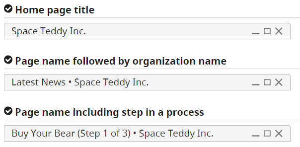
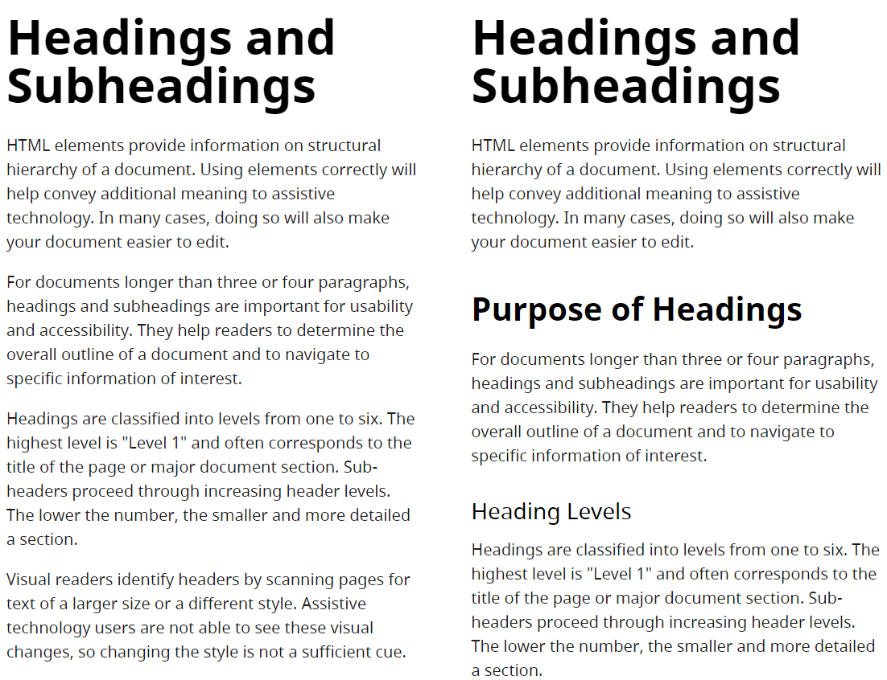
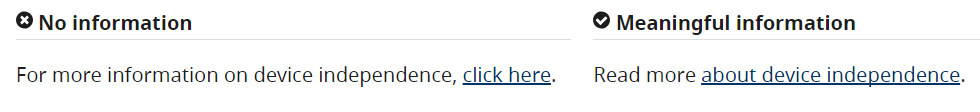
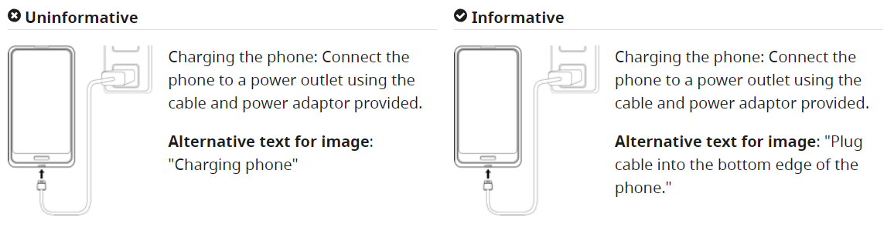
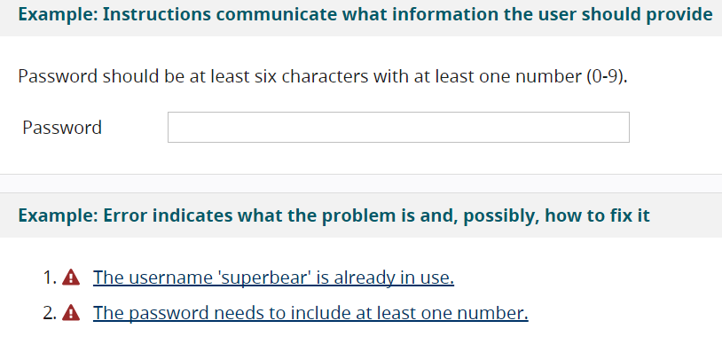
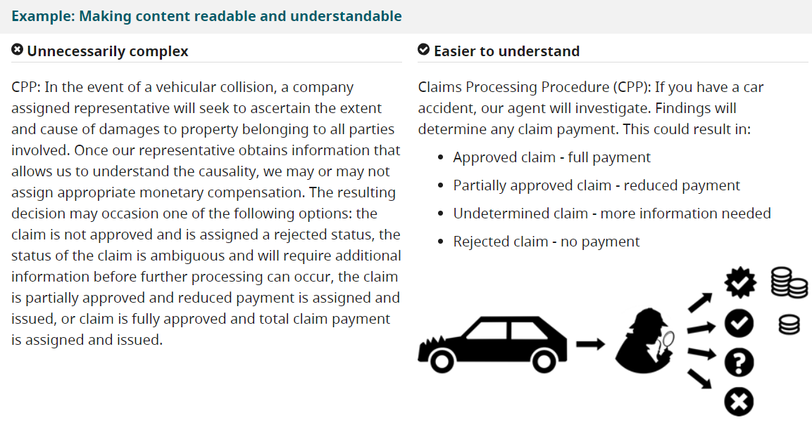

原文可见[W3C Tips for Getting Started Writing for Web Accessibility](https://www.w3.org/WAI/tips/writing/)

## 提高网页可访问性的技巧

这篇文章介绍一些能有助于你编写的网页内容让别人更容易访问的基本方法。这些方法是帮助你符合WCAG（Web Content Accessibility Guidelines 网页内容可访问性指导方案）要求的良好实践。

#### 提供有信息量的、独特的标题

网页应该提供能描述本网页内容的简短标题并与其它网页区分开来。这些网页的标题与文章标题同样重要。首先要独特、最具相关性的信息；其次，本网页的标题要放在网页路径的前面，作为多步骤进程的部分网页，应该包括当前位置在网页标题中。

#### 用小标题来传达文章的标题与结构

用小标题来归纳相关段落并直截了当描述分段。好的标题可以提供内容提纲。
 
 
 

#### 让文本链接有意义

写个文本链接以便描述链接目标的内容。避免使用模棱两可的文本链接，例如“点击这里”或“了解更多”。应该用文档的类型和大小来标明与链接目标相关的信息。

 

#### 给图片写有意义的替代文本

每一张图片都有替代文本描述该图片的信息和作用。对于纯装饰性的图片，就没必要写替代文本了。
 
 
 

#### 为多媒体创建说明文字

无论是类似播客的纯音频内容还是类似培训视频的视听内容，都应该提供说明文字。就用户理解内容而言，包含在说明文字中的口头信息与声音信息、视频信息同样重要。例如“门吱吱作响”、“Athan 离开房间”。

#### 提供清楚的提醒

要确保提供清楚的提醒、指导、错误警告，方便用户理解并且避免使用不必要的术语。类似数据格式，需要描述输入要求。

 
#### 保持内容简洁清晰

使用适于内容的简洁语言和格式
-	写简短清晰的句子和段落
-	避免使用不必要的复杂文字和句式。
-	第一次使用首字母缩略词要完整表达出来。
-	考虑一下为读者可能不知道的术语提供词汇表。
-	使用合适的列表格式
-	考虑使用图片、注解、视频、音频和象征性符号帮助用户理解意思

 
